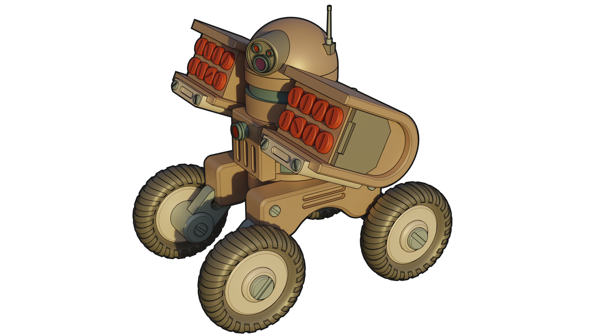

Game Development-related Code and Algorithms by Brett Kromkamp
==============================================================

As the title implies, this repo is (will be) a collection of code snippets and algorithms that are especially relevant for game development. The first set of commits are related to (2D) vectors, an understanding of which is critical for game development. Areas to explore also include graph (for example, Dijkstra and A*) and probability-related algorithms. 

Useful Links
------------
* `Guide to Game Development/Theory/Mathematics/Vectors <https://en.wikibooks.org/wiki/Guide_to_Game_Development/Theory/Mathematics/Vectors>`_
* *Pending...*

How to Contribute
-----------------

#. Check for open issues or open a fresh issue to start a discussion around a feature idea or a bug.
#. Fork `the repository`_ on GitHub to start making your changes to the **master** branch (or branch off of it).
#. Send a pull request and bug the maintainer until it gets merged and published. :) Make sure to add yourself to AUTHORS_.

.. _the repository: https://github.com/brettkromkamp/game-development
.. _AUTHORS: https://github.com/brettkromkamp/game-development/blob/master/AUTHORS.rst